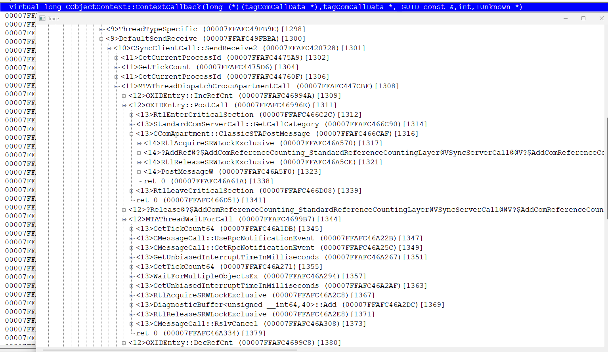
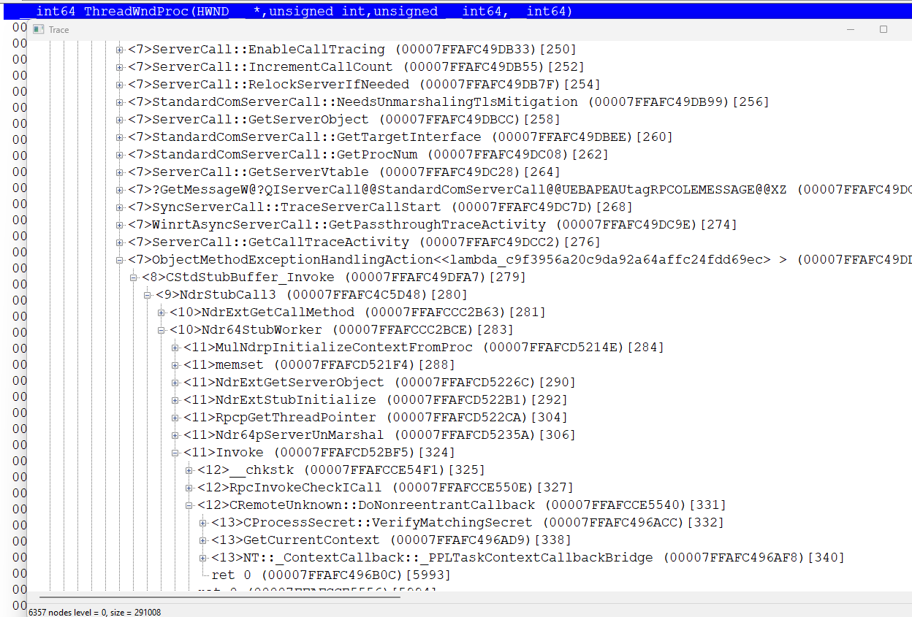
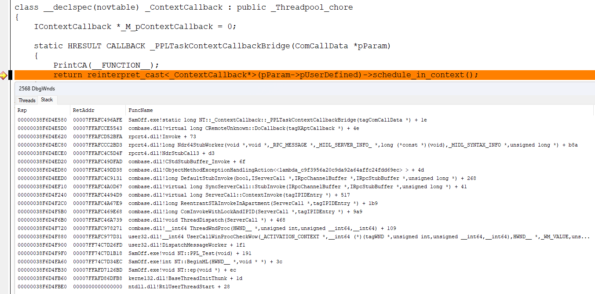

# Proxy

universal proxy for marshall any interface calls from any to STA apartment. without any assumptions about methods signatures. maximum fast and lightweight. 2 implementations: FProxy.cpp ( based on fibers) xor MProxy.cpp ( more fast and lightweight). the code[64/32].asm is common for both FProxy/MProxy.
( SwitchToStack procedure used only by MProxy )

for compare - standard way, based on IContextCallback interface, in file ContextCallback.cpp with call/stack trace.

```
============================================================================
IContextCallback
============================================================================

  2b2c 000000C423D00000-3b8 MAINSTA [ NONE ] > NT::PPL_Test<0000000000000000> ()
  0d58 000000C424100000-518 MTA     [ NONE ] > NT::ActivateMTA<0000000000000000> ()
  2b2c 000000C423D00000-438 MAINSTA [ NONE ] > NT::MyDemo::MyDemo<0000024E706A7270> ()
  2b2c 000000C423D00000-438 MAINSTA [ NONE ] > NT::_ContextCallback::_Capture<0000000000000000> ()
2b2c> Enter message Loop
  16ac 000000C424500000-bc8 MTA     [ IMPLICIT_MTA ] > NT::MyDemo::schedule<0000024E706A7270> ()
  16ac 000000C424500000-c38 MTA     [ IMPLICIT_MTA ] > NT::_ContextCallback::schedule<0000024E706A7270> ()
  2b2c 000000C423D00000-17c8 MAINSTA [ NONE ] > NT::_ContextCallback::_PPLTaskContextCallbackBridge<0000000000000000> ()
  2b2c 000000C423D00000-1838 MAINSTA [ NONE ] > NT::MyDemo::schedule_in_context<0000024E706A7270> ()
data written in 16ac context

  16ac 000000C424500000-bc8 MTA     [ IMPLICIT_MTA ] > NT::MyDemo::~MyDemo<0000024E706A7270> ()
2b2c> Exit message Loop


============================================================================
MProxy / x86
============================================================================
  18dc 00F00000-254 MAINSTA [ NONE ] > NT::CDemoItf::CDemoItf<010083E8> ()
  18dc 00F00000-280 MAINSTA [ NONE ] > NT::CDemoItf::AddRef<010083E8> ([2])
  25ac 03330000-89c MTA     [ NONE ] > NT::DoWork<01008410> (before call...)
.\MProxy.cpp(198): #1C: NT::FProxy::ClientCall
  25ac 03330000-8e0
.\MProxy.cpp(176): #2C: NT::FProxy::FiberProc
  25ac 0102A170-38
.\MProxy.cpp(262): #3C: NT::FProxy::MsgWindowProc
  18dc 00F00000-45c
.\MProxy.cpp(221): #4C: NT::FProxy::ClientCall
  18dc 03330000-8e0
  18dc 03330000-8dc MAINSTA [ NONE ] > NT::CDemoItf::SendReceive<010083E8> ()
NT::CDemoItf::SendReceive<010083E8>: [Client Data] from 25ac
.\MProxy.cpp(231): #5C: NT::RET_DATA::OnRet
  18dc 03330000-8bc
.\MProxy.cpp(279): #6C: NT::FProxy::MsgWindowProc
  18dc 00F00000-460
.\MProxy.cpp(186): #7C: NT::FProxy::FiberProc
  25ac 0102A170-38
.\MProxy.cpp(245): #8C: NT::RET_DATA::OnRet
  25ac 03330000-8bc
  25ac 03330000-89c MTA     [ NONE ] > NT::DoWork<01008410> (after call)
hr = 40020056: "[Server Data]" from 18dc
  25ac 03330000-8b0 [800401f0] > NT::CDemoItf::Release<010083E8> ([1])

18dc> NT::CDemoItf::SendReceive<010083E8>: [Client Data] from 25ac
25ac> hr = 40020056: "[Server Data]" from 18dc
A UUID that is valid only on this computer has been allocated.


============================================================================
FProxy / x86
============================================================================
  1b90 00D00000-2ec MAINSTA [ NONE ] > NT::CDemoItf::CDemoItf<00D083E8> ()
  1b90 00D00000-318 MAINSTA [ NONE ] > NT::CDemoItf::AddRef<00D083E8> ([2])
  11e0 03160000-964 MTA     [ NONE ] > NT::DoWork<00D08410> (before call...)
.\FProxy.cpp(182): #1C: NT::FProxy::ClientCall
  11e0 03160000-9a8
.\FProxy.cpp(162): #2C: NT::FProxy::FiberProc
  11e0 03260000-698
.\FProxy.cpp(237): #3C: NT::FProxy::MsgWindowProc
  1b90 00D00000-528
.\FProxy.cpp(196): #4C: NT::FProxy::ClientCall
  1b90 03160000-9a8
  1b90 03160000-9a4 MAINSTA [ NONE ] > NT::CDemoItf::SendReceive<00D083E8> ()
NT::CDemoItf::SendReceive<00D083E8>: [Client Data] from 11e0
.\FProxy.cpp(207): #5C: NT::RET_DATA::OnRet
  1b90 03160000-984
.\FProxy.cpp(256): #6C: NT::FProxy::MsgWindowProc
  1b90 00D00000-528
.\FProxy.cpp(170): #7C: NT::FProxy::FiberProc
  11e0 03260000-698
.\FProxy.cpp(220): #8C: NT::RET_DATA::OnRet
  11e0 03160000-984
  11e0 03160000-964 MTA     [ NONE ] > NT::DoWork<00D08410> (after call)
hr = 40020056: "[Server Data]" from 1b90
  11e0 03160000-978 [800401f0] > NT::CDemoItf::Release<00D083E8> ([1])

1b90> NT::CDemoItf::SendReceive<00D083E8>: [Client Data] from 11e0
11e0> hr = 40020056: "[Server Data]" from 1b90
A UUID that is valid only on this computer has been allocated.

============================================================================
FProxy / x64
============================================================================

  1f70 0000004A50300000-3c8 MAINSTA [ NONE ] > NT::CDemoItf::CDemoItf<00000181E0A0EB40> ()
  1f70 0000004A50300000-418 MAINSTA [ NONE ] > NT::CDemoItf::AddRef<00000181E0A0EB40> ([2])
  1578 0000004A50700000-cc8 MTA     [ NONE ] > NT::DoWork<00000181E0A15500> (before call...)
.\FProxy.cpp(182): #1C: NT::FProxy::ClientCall
  1578 0000004A50700000-d58
.\FProxy.cpp(162): #2C: NT::FProxy::FiberProc
  1578 0000004A50800000-2d8
.\FProxy.cpp(237): #3C: NT::FProxy::MsgWindowProc
  1f70 0000004A50300000-688
.\FProxy.cpp(196): #4C: NT::FProxy::ClientCall
  1f70 0000004A50700000-d58
  1f70 0000004A50700000-d68 MAINSTA [ NONE ] > NT::CDemoItf::SendReceive<00000181E0A0EB40> ()
NT::CDemoItf::SendReceive<00000181E0A0EB40>: [Client Data] from 1578
.\FProxy.cpp(207): #5C: NT::RET_DATA::OnRet
  1f70 0000004A50700000-d28
.\FProxy.cpp(256): #6C: NT::FProxy::MsgWindowProc
  1f70 0000004A50300000-688
.\FProxy.cpp(170): #7C: NT::FProxy::FiberProc
  1578 0000004A50800000-2d8
.\FProxy.cpp(220): #8C: NT::RET_DATA::OnRet
  1578 0000004A50700000-d28
  1578 0000004A50700000-cc8 MTA     [ NONE ] > NT::DoWork<00000181E0A15500> (after call)
hr = 40020056: "[Server Data]" from 1f70
  1578 0000004A50700000-cc8 [800401f0] > NT::CDemoItf::Release<00000181E0A0EB40> ([1])

1f70> NT::CDemoItf::SendReceive<00000181E0A0EB40>: [Client Data] from 1578
1578> hr = 40020056: "[Server Data]" from 1f70
A UUID that is valid only on this computer has been allocated.

============================================================================
MProxy / x64
============================================================================
  2404 000000162A100000-288 MAINSTA [ NONE ] > NT::CDemoItf::CDemoItf<0000020D06E253F0> ()
  2404 000000162A100000-2d8 MAINSTA [ NONE ] > NT::CDemoItf::AddRef<0000020D06E253F0> ([2])
  0f10 000000162A500000-a18 MTA     [ NONE ] > NT::DoWork<0000020D06E25440> (before call...)
.\MProxy.cpp(198): #1C: NT::FProxy::ClientCall
  0f10 000000162A500000-a98
.\MProxy.cpp(176): #2C: NT::FProxy::FiberProc
  0f10 0000020D06E280A0-68
.\MProxy.cpp(262): #3C: NT::FProxy::MsgWindowProc
  2404 000000162A100000-568
.\MProxy.cpp(221): #4C: NT::FProxy::ClientCall
  2404 000000162A500000-a98
  2404 000000162A500000-ab8 MAINSTA [ NONE ] > NT::CDemoItf::SendReceive<0000020D06E253F0> ()
NT::CDemoItf::SendReceive<0000020D06E253F0>: [Client Data] from 0f10
.\MProxy.cpp(231): #5C: NT::RET_DATA::OnRet
  2404 000000162A500000-a78
.\MProxy.cpp(279): #6C: NT::FProxy::MsgWindowProc
  2404 000000162A100000-568
.\MProxy.cpp(186): #7C: NT::FProxy::FiberProc
  0f10 0000020D06E280A0-68
.\MProxy.cpp(245): #8C: NT::RET_DATA::OnRet
  0f10 000000162A500000-a78
  0f10 000000162A500000-a18 MTA     [ NONE ] > NT::DoWork<0000020D06E25440> (after call)
hr = 40020056: "[Server Data]" from 2404
  0f10 000000162A500000-a18 [800401f0] > NT::CDemoItf::Release<0000020D06E253F0> ([1])

2404> NT::CDemoItf::SendReceive<0000020D06E253F0>: [Client Data] from 0f10
0f10> hr = 40020056: "[Server Data]" from 2404
A UUID that is valid only on this computer has been allocated.

```




[CObjectContext_ContextCallback.tvi](https://github.com/rbmm/TVI/blob/main/DEMO/CObjectContext_ContextCallback.tvi)
[ThreadDispatch.tvi](https://github.com/rbmm/TVI/blob/main/DEMO/ThreadDispatch.tvi)
open with [tvi.exe](https://github.com/rbmm/TVI/blob/main/X64/tvi.exe)
